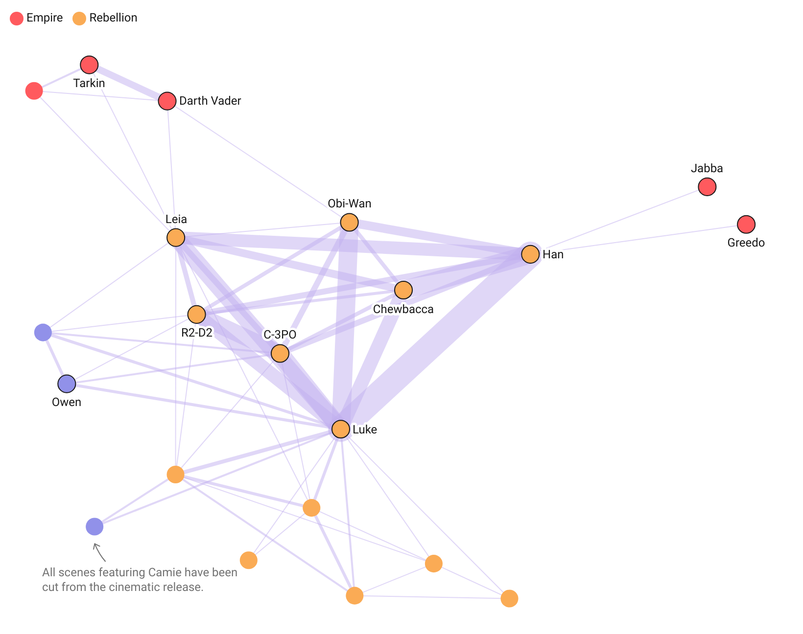

# nx2dw

A small utility to visualize [NetworkX](https://networkx.org/) graphs as [Datawrapper](https://www.datawrapper.de/) scatterplots. This tool helps transform your graph data into interactive, visually appealing scatterplots using Datawrapper.

## Setup

1. Clone this repository:
   
   ```bash
   git clone https://github.com/jfreyberg/nx2dw.git
   cd nx2dw
  
2. Import the nx2dw class:
   
   ```python
   from nx2dw import nx2dw
   
3. Initialize the client with your [Datawrapper API token](https://developer.datawrapper.de/docs/getting-started) (chart write rights required):

   ```python
   client = nx2dw(ACCESS_TOKEN, TEAM_ID, FOLDER_ID)
   ```
   - Replace ACCESS_TOKEN with your API token.
   - TEAM_ID and FOLDER_ID are optional parameters for organizing your output.

4. Create a visualization from a NetworkX graph:

   ```python
   chart_id = client.create_datawrapper_graph(networkx_graph_object)

## Customization

You can customize the network by passing additional arguments to `create_datawrapper_graph`.
For details, see [the source code](https://github.com/jfreyberg/nx2dw/blob/main/nx2dw.py).
Refer to the [example usage script](https://github.com/jfreyberg/nx2dw/blob/main/example.py) for more insights.
After generating the network you can further customize and edit it in the Datawrapper editor. 

## Example Output

Here's an example of what you can create with this tool:



<sub>Data is from [Kaggle: Star Wars Social Network](https://www.kaggle.com/datasets/ruchi798/star-wars)</sub>
